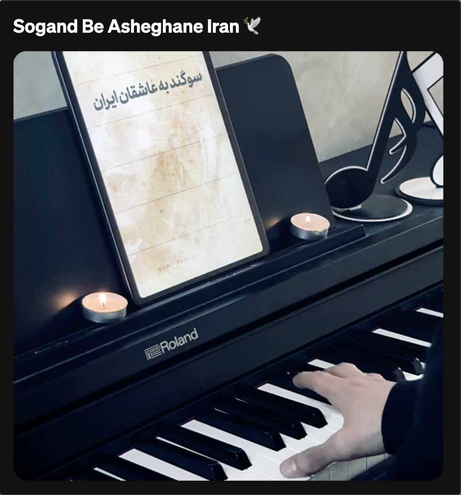
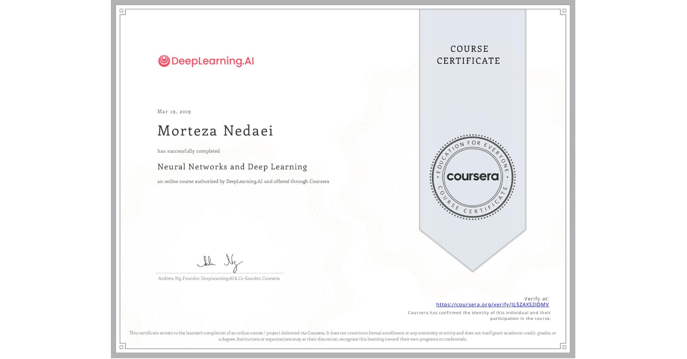

<h1 align="center">Morteza Nedaei</h1>

  <strong>Software Engineer · AI Master's · Pianist</strong>

  
  
  
  
  
  
  
  
  
  

  
  

---

# 👨‍💻 About

Software Engineer with a Master's in Artificial Intelligence, architecting mobile, backend and frontend systems in cross-functional teams.

**Tech Stack**

| Domain            | Technologies |
|-------------------|----------------------------------------------------------------------------------------------------------------------------------------------------------------------------------------------------------------------------------------------------------------------------------------------------------------------------------------------------------------------------------------------------------------------------------------------------------------------------------------------------------------------------------------------------------------------------------------------------------------------------------------------------------------------------------------------------------------------------------------------------------------------------------------------------------------------------------------------------------------------------------------------------------------------------------------------------------|
| Backend           |          |
| Mobile            |            |
| Frontend          |      |
| Data Science & AI |       |
| CI/CD             |      |
| Agile             |   |
| Tools             |            |

---

# 🎹 Piano

> Engineering systems by day, composing melodies by night!  
> I record covers and original pieces on my channels.

<table>
  <tr>
    <td align="center">
       
      <b>Mardom — Moein</b> 
      
      
      
    </td>
    <td align="center">
       
      <b>Booye Eydi — Farhad</b> 
      
      
      
    </td>
    <td align="center">
       
      <b>Passacaglia</b> 
      
      
    </td>
  </tr>
  <tr>
    <td align="center">
       
      <b>Sogand Be Asheghane Iran</b> 
      
      
      
    </td>
    <td align="center">
       
      <b>Corazón De Niño (Child’s Heart)</b> 
      
      
    </td>
    <td></td>
  </tr>
</table>

---

# 💼 Experience

**Senior Software Engineer / Technical Lead** @ [Tapsell](https://ir.linkedin.com/company/tapsell)  
Technical Lead architecting and publishing cross-platform Android SDKs and optimizing backend microservices.  

  
<b>Key Achievements & Responsibilities</b>

  <ul>
    <li>Published Android SDKs to MavenCentral, NPM, Pub, and GitHub using Java, Kotlin, Flutter, React Native, Cordova, Unity, adopted by over 2,500 developers and companies.</li>
    <li>Analyzed and monitored SDK performance using Elastic Kibana and Grafana to optimize system efficiency.</li>
    <li>Optimized Back-End Microservices with Spring Boot, Kafka, Redis, and Kubernetes, enhancing functionality and scalability.</li>
    <li>Modularized libraries with features that made developing and implementing the SDK 50% faster.</li>
    <li>Automated SDK release pipelines, reducing publishing time by 50%.</li>
    <li>Performed improvements as a Technical Support Engineer, which led to the reduction of user inquiries and reported issues on GitHub by 30%.</li>
    <li>Deployed developer docs using Dokka, MK-Docs, and Docusaurus, reducing documentation time by 50%.</li>
    <li>Enhanced testing pipelines by integrating tools like Konsist, Junit, Jacoco, Kover, Ktlint, and Detekt, achieving 70% test coverage and ensuring code consistency, quality, and maintainability.</li>
    <li>Introduced “Automated UI Smock Testing In 5 Minutes” with Appium & Maestro to improve the QA testing.</li>
  </ul>

 

**Senior Software Engineer** @ [COTO](https://www.linkedin.com/company/cotobyeveworld)  
Contributed to a Web3 social community platform app written in Kotlin and Jetpack Compose with **1M+ Users**.  

  
<b>Key Achievements & Responsibilities</b>

  <ul>
    <li>Engaged in a Web3 social community platform app, installed by +1 million users from Google Play and App Store, written in Kotlin and Jetpack Compose.</li>
    <li>Collaborated remotely with 15 multinational Android developers as part of a global team.</li>
    <li>Improved Google Play's crash-free rate by 35% through targeted bug fixes and performance optimizations.</li>
  </ul>

 

**Senior Mobile Engineer** @ [IranAirTour Airlines](https://www.linkedin.com/company/iranairtour)  
Released React Native enterprise mobile applications for pilots and crew members in a trusted airline.  

  
<b>Key Achievements & Responsibilities</b>

  <ul>
    <li>Participated with a cross-platform team in one of the 5 most experienced and trusted airlines.</li>
    <li>Released several apps to the App Store, installed by over 500 pilots and crew members.</li>
    <li>Implemented enterprise applications that increased the company's revenue by 5% with a reduction of traditional procedures through modern solutions like React Native, Typescript, Multithreading, redux-toolkit, redux-saga, Axios, offline DB, Formik, etc.</li>
  </ul>

 

**Android Software Engineer** @ [Tivasoft](https://www.linkedin.com/company/tivasoft)  
Developed educational and retail apps featuring AR/VR technologies.  

  
<b>Key Achievements & Responsibilities</b>

  <ul>
    <li>Built the Mahout Android app to make the educational system better in the Chinese market.</li>
    <li>Made the CarpetCity Android app that uses Augmented Reality (AR) and Virtual Reality (VR), which reduced the need for customers to visit by 15%.</li>
  </ul>

 

**Android Developer Intern** @ [TCI](https://www.linkedin.com/company/telecommunication-company-of-iran---tci)  
Designed network analysis applications in Java.  

  
<b>Key Achievements & Responsibilities</b>

  <ul>
    <li>Designed a Java Network-based Application that provided network features like finding IPs, Device Hardware Info, Doing Ping tests, Traceroute, etc.</li>
  </ul>

---

# 🎙️ Talks & Workshops

  
   
  <b>Kotlin Coroutines Flow & Channels Workshop at Tapsell</b> 
  

---

# 🚀 Projects

**MeowJumper** - Kotlin Multiplatform mobile game  

---

# 📝 Articles

**How to get Military Service Project?**  

---

# 📜 Licenses & Certifications

<table>
  <tr>
    <td width="200" align="center" valign="middle">
      
    </td>
    <td valign="middle">
      <strong>Neural Networks and Deep Learning</strong> 
      Coursera Course Certificate (Mar 2019)  
      
    </td>
  </tr>
</table>

---

# 📈 GitHub Stats

  

---

  
  &nbsp;
  

⚡ "The best line of code is the one you don't write."

